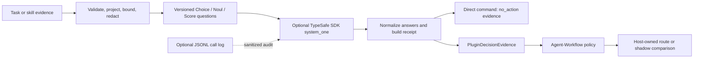
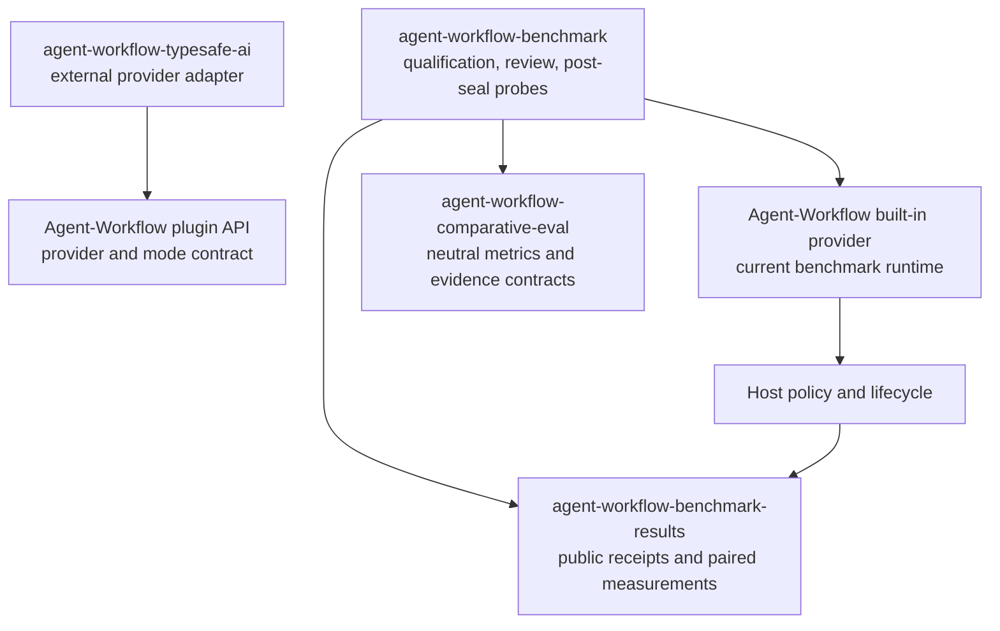

# Agent-Workflow TypeSafe AI

`agent-workflow-typesafe` is an external Agent-Workflow plugin that makes
optional [TypeSafe AI](https://typesafe.ai/) API calls through its Jev/System
One typed-decision API. It augments bounded decisions with Choice, Noul, and
Score evidence while Agent-Workflow retains deterministic authority.

## What it does

- Projects bounded, redacted task or skill evidence into TypeSafe AI questions.
- Calls the optional TypeSafe AI/Jev API and normalizes typed answers into
  versioned, secret-free semantic receipts.
- Provides advisory routing metadata: task class, interaction need, and
  semantic consequence/risk.
- Evaluates whether a skill directs a required behavior, plus independent
  completeness and actionability evidence.
- Reports compatibility and credential-free diagnostics through
  `agent-workflow typesafe compatibility` and `doctor`.

Direct command outputs are advisory `no_action` receipts. The optional decision
provider exposes the same typed evidence to compatible Agent-Workflow policy;
the host decides whether to apply it or retain it in shadow mode. The plugin itself
never owns routing, executor or model policy, lifecycle, evaluation, review, or
acceptance. Missing credentials, an unavailable SDK, uncertain answers, and
service failures produce distinct statuses with no-action fallback.

Install the base package for discovery, compatibility checks, and semantic
receipts. Install `agent-workflow-typesafe[typesafe]` only to make live TypeSafe
calls. Install `agent-workflow-typesafe[eval]` for the shared comparative-evaluation
library, or `agent-workflow-typesafe[typesafe-eval]` for both optional capabilities. `TYPESAFE_API_KEY` is read only by the optional live adapter;
it is never written to configuration, receipts, or logs.

Enable it in Agent-Workflow configuration:

```toml
[plugins]
enabled = ["agent-workflow-typesafe"]
```

Then use `agent-workflow typesafe compatibility`, `doctor`, `advise-routing`,
or `evaluate-skill`. Live calls require both the optional extra and the normal
runtime environment key. The distribution and entry-point names remain stable
for host compatibility even though the public repository is named
`agent-workflow-typesafe-ai`.

## TypeSafe API call logging

API call logging is disabled by default. To opt in, set `TYPESAFE_API_CALL_LOG`
to a JSONL file path. Each attempted TypeSafe call records the bounded projected
input, question set, normalized output (or exception class), request hash, model,
status, and duration. Secrets and authorization-like fields are redacted, and
logger I/O failures never affect the advisory result. Treat the file as sensitive
because projected task and skill text may be retained.

## Comparative evaluation

Comparative evaluation is now split across a dependency-neutral shared library and
this provider-specific plugin. `agent-workflow-comparative-eval` owns canonical
comparison contracts, datasets, pairing/metrics/statistics, and neutral evidence.
This plugin retains TypeSafe/Jev execution and candidate telemetry only.

For the 0.1.x migration window, `agent_workflow_typesafe.evaluation` remains as a
compatibility facade. With the `[eval]` extra installed it delegates generic work to
the shared library; without that extra it uses the frozen 0.1.0 implementation so
base plugin installs do not acquire a new required dependency. Existing
`agent-workflow-typesafe/.../v1` observation artifacts remain readable; new
integrations should use the neutral shared-library schema namespace.

See [docs/comparative-evaluation/README.md](docs/comparative-evaluation/README.md).

## Agent-Workflow decision modes

On an Agent-Workflow host that supports dynamic decision providers, this plugin advertises two modes:

- `typesafe` — TypeSafe semantic evidence is eligible for bounded Agent-Workflow policy consumption on approved decision seams;
- `comparative` — the same TypeSafe evidence is evaluated in shadow mode while deterministic control remains authoritative.

The plugin does not own thresholds, fallback, routing authority, lifecycle, review, or acceptance. Those remain Agent-Workflow policy. Use `agent-workflow decision modes` to inspect the modes actually available from enabled plugins.

## Integration design

The package separates state preparation, TypeSafe transport, evidence, and host
policy. Routing and skill-evaluation inputs have independent versioned question
sets. Projection validates required fields, bounds text and collections, redacts
secret-like values, and hashes the canonical request. The optional SDK adapter
calls `system_one`; normalized answers are wrapped in a `semantic-advice/v1alpha1`
receipt with source references, model, request hash, host version, status, and
fallback. Compatibility is exact-version checked before a live request. API keys
are read from the runtime environment and never enter projections or receipts.

| Question set | Typed questions | Meaning |
| --- | --- | --- |
| `routing/v1alpha1` | `Choice` `routing.task_class`; `Noul` `routing.interaction_required`; `Score` `routing.semantic_risk` | Work class, need for a missing user decision, and consequence of misunderstanding the request |
| `skill-evaluation/v1alpha1` | `Noul` `skill.behavior_satisfied`; `Score` `skill.completeness`; `Score` `skill.actionability` | Whether skill text directs a requested behavior, and whether its guidance is complete and actionable |

Direct `agent-workflow typesafe advise-routing` and `evaluate-skill` commands
return validated no-action receipts. The plugin decision-provider hook translates
those typed answers to the host's `PluginDecisionEvidence` contract. A host may
consume only registered decisions through its own policy; this package does not
set thresholds or decide what evidence changes an application outcome. In version
0.1.2, `typesafe` advertises host-policy consumption and `comparative` advertises
shadow evidence capture. Compatibility metadata verifies Agent-Workflow 0.10.0,
0.10.1, and 0.10.2; operators should check the published compatibility contract
before enabling that plugin against another host version.



The opt-in `TYPESAFE_API_CALL_LOG` sink is placed at the service seam, where the
projected state, question set, request hash, model, and normalized output are
available. It bounds and redacts nested values, records service failures by
exception class, and ignores logger I/O errors so observability cannot change an
advisory result. The JSONL file can retain task or skill text and should be treated
as sensitive. Logging is disabled by default.

## How the integration expanded across repositories

This repository is the optional external-plugin implementation: it packages the
projection, questions, TypeSafe SDK call, compatibility checks, receipts, and
plugin API bridge. The current [Agent-Workflow host](https://github.com/ngallodev-software/agent-workflow)
also has a built-in optional provider for the three bounded routing questions.
That host implementation independently keeps route enforcement, uncertainty
fallback, Agent Run lifecycle, review, and acceptance in Agent-Workflow. The
host built-in covers the routing question set; the standalone package's three
skill-behavior/completeness/actionability questions remain package-specific. The
benchmark studies use the host's built-in provider; they do not install this
repository as their runtime provider.

The supporting repositories give the same semantic evidence a measured boundary:



The benchmark repository uses TypeSafe in three separate ways: pre-treatment
routing qualification, supplementary matched-file source review, and optional
post-seal `typesafe-batch` scoring probes. Qualification runs outside both paired
arms; advisory source review does not revise deterministic findings; post-seal
probes run only after execution evidence is sealed. The shared
[comparative-evaluation library](https://github.com/ngallodev-software/agent-workflow-comparative-eval)
owns neutral records, datasets, pairing, metrics, and statistics. TypeSafe
execution and provider-specific telemetry remain with the provider/host; benchmark
lifecycle and publication eligibility remain with their respective owners. See
the [benchmark plugin documentation](https://github.com/ngallodev-software/agent-workflow-benchmark)
and the [public benchmark results](https://github.com/ngallodev-software/agent-workflow-benchmark-results).

## What the published studies show

BM3, BM4, and BM5 each published three successful qualification calls, one for
each benchmark phase. Each phase call requests the routing `Choice`, `Noul`, and
`Score` questions. BM3 had one task-class disagreement under shadow disposition
and risk-score uncertainty fallbacks in all phases; BM4 and BM5 matched the
deterministic route recommendation in all three phases. These calls were excluded
from both treatments, so they are adapter and disagreement diagnostics, not
evidence that TypeSafe caused the task-score, time, or token differences.

BM4 separately published an advisory TypeSafe source-review run over seven
matched source files: Jev `jev-1.13.0`, seven requests, 38,295 input tokens,
1,190 output tokens, and 1.601 seconds reported service duration. The advisory
aggregate quality estimates were 63.25 for structured direct and 58.80 for
Agent-Workflow optimized. They are not benchmark machine scores, human review,
or acceptance evidence. BM3–BM5 are single-pair development studies; BM3 lacks
required visual evidence, and BM5 has no human-complete pair. The public result
pages contain full metrics and limitations: [BM3](https://github.com/ngallodev-software/agent-workflow-benchmark-results/tree/main/bm3),
[BM4](https://github.com/ngallodev-software/agent-workflow-benchmark-results/tree/main/bm4),
and [BM5](https://github.com/ngallodev-software/agent-workflow-benchmark-results/tree/main/bm5).

Official background: [Jev and System One](https://typesafe.ai/blog/introducing-system-one-models-and-jev),
[System One](https://docs.typesafe.ai/concepts/system-one.md),
[state](https://docs.typesafe.ai/concepts/state.md),
[Choice](https://docs.typesafe.ai/primitives/choice.md),
[Noul](https://docs.typesafe.ai/primitives/noul.md),
[Score](https://docs.typesafe.ai/primitives/score.md), and the
[Python SDK](https://docs.typesafe.ai/sdk/python.md).
