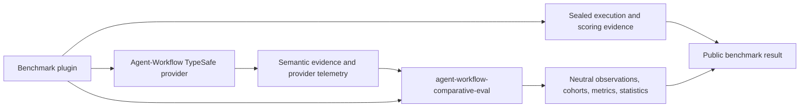

# Comparative Evaluation Ownership

Comparative evaluation is shared infrastructure, not TypeSafe-specific application authority.

Canonical owner: `agent-workflow-comparative-eval` (`agent_workflow_comparative_eval`).

The shared library owns neutral schemas/models, legacy artifact upgrades, canonical hashing,
pairing/cohort identity, reusable metrics/statistics, and frozen oracle datasets. This plugin
owns TypeSafe/Jev projection, questions, SDK calls, semantic receipts, and candidate telemetry.
Agent-Workflow owns control execution, shadow scheduling, lifecycle storage/outcome joins,
review, and acceptance authority.

## Compatibility window

`agent_workflow_typesafe.evaluation` remains available during the 0.1.x series. With
`agent-workflow-typesafe[eval]`, it delegates generic operations to the shared library while
translating canonical observations back to the historical TypeSafe schema ID for old callers.
The `neutral_observation` and `neutral_run_static_cases` helpers require the shared library and
return canonical neutral artifacts.

The packaged `resources/evaluation/*.json` corpora are retained byte-for-byte as compatibility
copies until consumers have migrated. Their canonical future home is the shared library.

## Privacy and authority

Comparative evidence never grants workflow authority. Shadow candidates remain unapplied unless
an independently approved host policy changes that behavior. Raw task/skill text and API keys
must not be persisted in comparative evidence.

## How this relates to the TypeSafe plugin and benchmark repositories

This repository's `agent-workflow-typesafe` package is the optional external
provider adapter: it owns TypeSafe/Jev projection, typed question sets, SDK calls,
semantic receipts, and provider-specific call telemetry. The current Agent-Workflow
integration has a built-in TypeSafe provider; its source lives in the host, and
current benchmark runs use that provider rather than installing this external
package. The standalone package and its verified-host list remain a separate
compatibility surface. See the [plugin integration overview](../../README.md#how-the-integration-expanded-across-repositories)
and the [Agent-Workflow provider description](https://github.com/ngallodev-software/agent-workflow#optional-bounded-semantic-decisions).

The benchmark plugin adds controlled qualification, advisory source review, and
post-seal TypeSafe scoring probes around the host integration. This library does
not make those calls or own benchmark execution; it makes their comparison records
neutral and reproducible. Published BM3–BM5 summaries report three successful
pre-treatment routing qualification calls per study, with the calls excluded from
paired treatments. BM4's separate seven-file advisory review used seven requests
and 38,295 input tokens; neither result changes machine-score or eligibility
authority. See the [benchmark plugin README](https://github.com/ngallodev-software/agent-workflow-benchmark)
and the [public result summaries](https://github.com/ngallodev-software/agent-workflow-benchmark-results).

